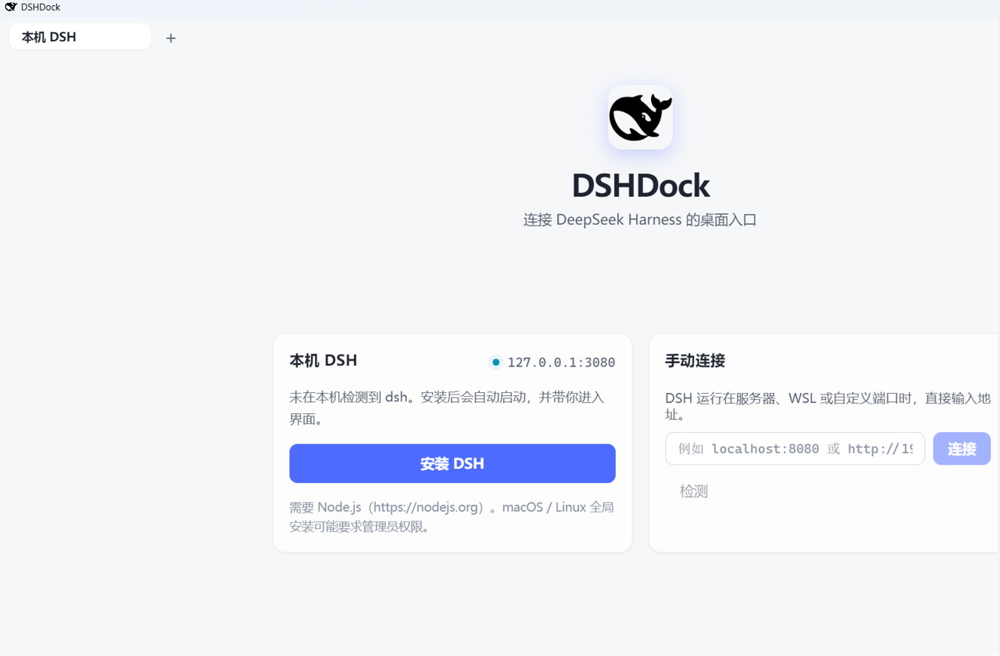
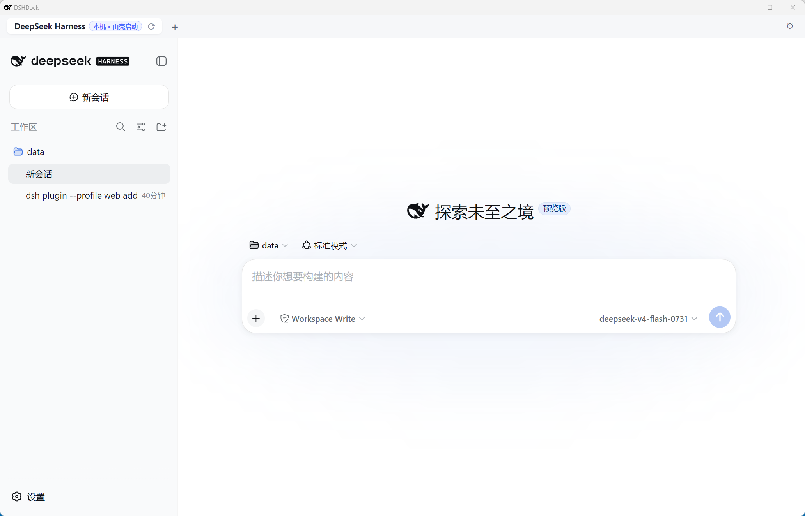
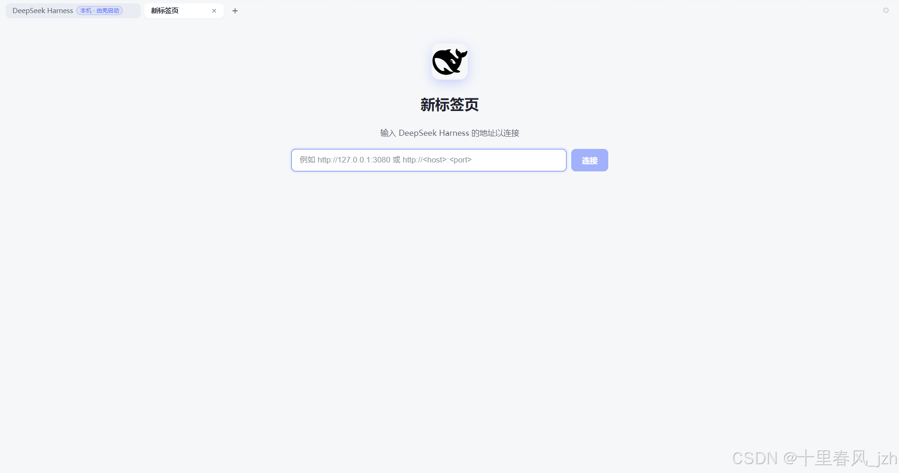

# DSHDock

DeepSeek Harness（dsh）的跨平台桌面壳（wrapper）—— 一个"DSH 专用浏览器"。

**设计原则：不集成 DSH 代码，只依赖 DSH 文档化的外部契约**（npm 包名 `@deepseek-ai/dsh`、`dsh --profile web` CLI 参数、HTTP 根页面标记），因此 **DSH 官方更新时本壳无需任何改动**。

## 界面预览
落地页（未安装 / 手动连接） 
 
主页
 
多标签
 
> 主页展示的是连接前的"新标签页"界面；连接后的内容区为 DSH 官方界面。

## 启动行为

1. 启动后自动探测本机 DSH 是否在运行（默认 `http://127.0.0.1:3080`，用 DSH 界面标记校验，避免把端口上别的服务误认为 DSH）。
2. **在运行** → 直接打开界面。
3. **未运行但已安装**（npm 全局包存在）→ **自动启动**本机 DSH（自动挑端口、等待就绪）并进入界面。
4. **未安装** → 落地页提供：
   - **手动输入 URL**：连接服务器、WSL、自定义端口上的 DSH；
   - **安装 DSH**：`npm install -g @deepseek-ai/dsh`，实时显示输出，成功后自动启动并进入界面。

## 特性

- 内置浏览器窗口（Electron `WebContentsView`，与 DSH 官方测试的 Chromium 一致）；地址栏、前进/后退/刷新、DevTools（`Ctrl+Shift+I`）、缩放（`Ctrl+=` / `Ctrl+-` / `Ctrl+0`）。
- 端点管理器：连接过的地址自动保存，可随时切换；默认本地地址可配置。
- 由壳启动的本地 DSH 进程默认随壳退出而结束（避免孤儿进程）；可在设置中开启"保持运行"。
- 边界情况：若壳被异常终止（任务管理器强制结束、崩溃、断电），正常退出清理不会执行，由壳启动的 DSH 可能残留为后台进程。重新打开壳通常会探测并重新连上它，也可在任务管理器中手动结束。
- 持久会话（`persist:dsh` partition）：远程带登录的 DSH 无需反复登录。
- 单实例锁：重复启动会聚焦已有窗口。
- 跨平台：Windows / macOS / Linux（electron-builder 打包）。

## 开发

```bash
npm install
npm run dev        # electron-vite 开发模式
npm run typecheck  # tsc 双配置检查
npm test           # vitest 单测 + 集成测试
npm run build      # 构建产物到 out/
npm run dist       # 当前平台打包到 release/
npm run dist:win|dist:mac|dist:linux
```


## 常见场景

| 场景 | 操作 |
|---|---|
| DSH 装在本机且已运行 | 启动壳 → 直接进入 |
| DSH 装在本机但未运行 | 启动壳 → 自动启动并进入 |
| DSH 在 WSL2 里 | 手动连接 `http://localhost:3080`（WSL2 自动转发 loopback） |
| DSH 在 WSL1 里 | 手动连接 WSL 虚拟机 IP，如 `http://<WSL-IP>:3080` |
| DSH 在远程服务器 | 手动连接 `http://<host>:<port>`；需要登录则正常在窗口内登录 |
| 本机 3080 端口被其他程序占用 | 壳自动换一个空闲端口启动本地 DSH |
| macOS / Linux 全局安装 DSH 权限不足 | 终端执行 `sudo npm install -g @deepseek-ai/dsh` 后重启壳 |


